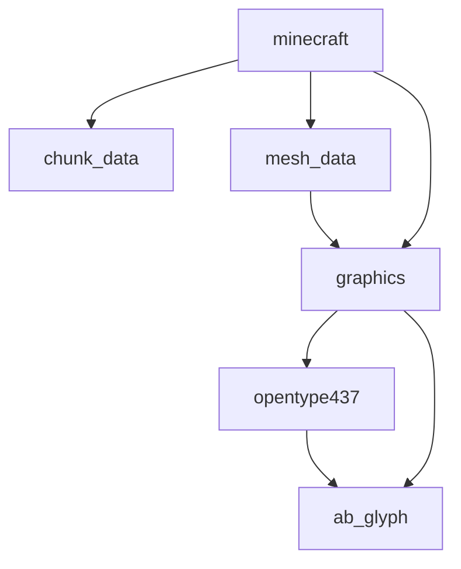

# Not Minecraft Beta 1.0.2

See http://phoenixkahlo.com/hubs/notminecraftbeta102

To run, `cargo run`. Is simple :)

## Things to it

|thing|to it|
|---|---|
|graphics|core systems good, need enhancements|
|physics|core systems good, but FP precision-related problems|
|blocks|core systems good|
|GUI|core systems good|
|sound|core systems good|
|items|not started|
|mobs|not started|
|save file|not started|
|multiplayer|not started|
|interpolation|not started|
|game content|few things added|

## Packages

- `ab_glyph`: fork of `ab_glyph` that makes a constructor public
- `opentype437`: implementation of `ab_glyph::Font` based on a code page 437
  image
- `graphics`: the renderer
- `chunk_data`: in-memory data structures for the world grid and its content
- `mesh_data`: efficient patch-based structure for managing the world mesh
- `minecraft`: the final binary that gets run

## Next steps

- fix physics bug
- fix windowing bug
- GpuImage(Array) unification
- deconfuse chirality
- particles
- fog and sky
- factor out main menu components

Then: multiplayer + save file "epic"
